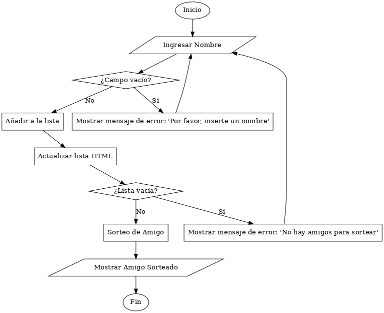

# Amigo Secreto - Gestión de Amigos

Este proyecto es una aplicación web simple que permite a los usuarios gestionar una lista de amigos, agregar nombres, visualizar la lista, y seleccionar un amigo secreto de manera aleatoria. Fue desarrollado con JavaScript, HTML y CSS, utilizando lógica sencilla para fortalecer habilidades de programación.

📂 amigo-secreto

├── 📄 index.html        # Archivo principal de la interfaz

├── 📄 style.css         # Estilos para la interfaz

├── 📄 app.js            # Lógica del proyecto

└── 📄 README.md         # Documentación del proyecto


## Diagram de flujo



## Funcionalidades

- **Agregar Amigo**: Permite al usuario agregar nombres a una lista de amigos.
- **Actualizar Lista**: Muestra dinámicamente la lista actualizada en la interfaz.
- **Sortear Amigo**: Selecciona de manera aleatoria un nombre de la lista.
- **Validación de Entradas**: Comprueba que los campos no estén vacíos antes de procesarlos.

## Requisitos de Instalación

1. Clonar este repositorio:
   ```bash
   git clone https://github.com/yoelcolque/practicasAluraLatam.git

## Proceso de Desarrollo

Para gestionar las tareas y el flujo de trabajo, utilizamos un tablero de Trello. Puedes acceder al tablero para ver las etapas del desarrollo:

- [Tablero de Trello: Challenge Amigo Secreto](https://trello.com/invite/b/678ef0f13eea3d720fa64143/ATTI9835fe9a6361143df75831d4bb645f00B3D5AAC0)

## Ramas Utilizadas

Durante el desarrollo, se utilizaron las siguientes ramas en el control de versiones:

- **main**: Rama principal con la versión estable.
- **funAgregarAmigos**: Implementación de la funcionalidad para agregar amigos.
- **funActualizarListaAmigos**: Funcionalidad para actualizar dinámicamente la lista en la interfaz.
- **funSortearAmigo**: Implementación de la lógica para sortear un amigo secreto.
